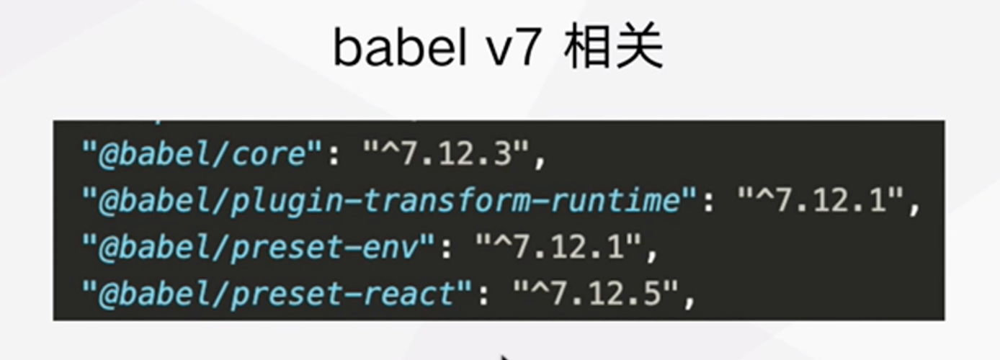
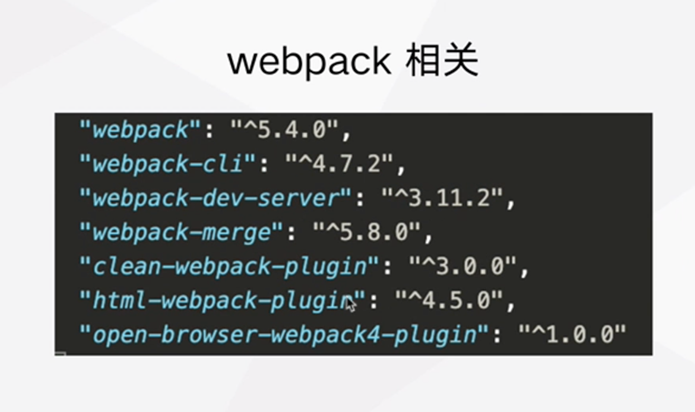
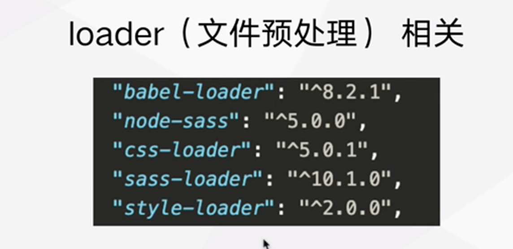
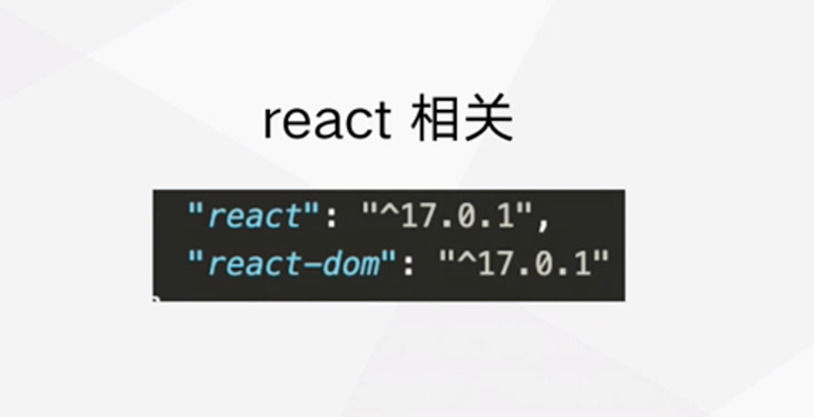
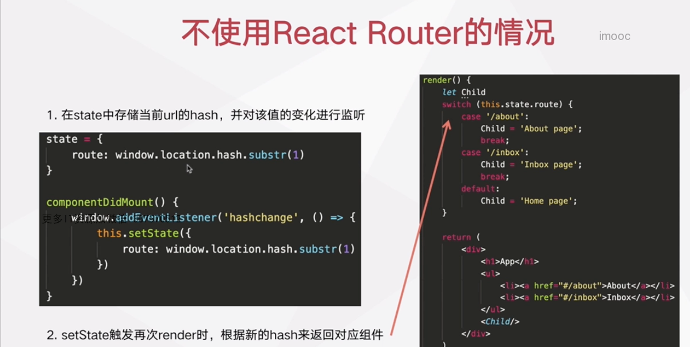

## 广告营销平台 2-6

### 第二章

2.1 完成前端工程初始化

`概述:` 基于 webpack5 + react 完成开发与生产环境配置

`packages:` babel7 相关、webpack5 相关、loader（文件预处理）相关、React 相关

 babel-core: 将新版的 JS 语法转换为 AST; plugin-transform-runtime: 新的 API polyfill, 解决大量重复 polyfill, helper; 从一个统一的地方引用 解决大量的变量污染问题; preset-env: 转化 ES 最新的语法，preset-react:转化 react jsx 语法

> 实战操作

1. package.json 配置
2. webpack 配置
3. 本地开发环境启动与打包验证

FAQ:

1. 使用 webpack5 时出现打包出错怎么办?

检查当前版本的配置规则是否正确, 调整某个依赖包的版本

2.2 eslint 相关配置

> 安装 Eslint 相关的包

eslint@7.13.0 eslint-config-airbnb@18.2.1 eslint-plugin-import@2.22.1 eslint-plugin-jsx-a11y@6.4.1 eslint-plugin-react@7.21.5 eslint-plugin-react-hooks@4.2.0

> 编辑 Eslint 配置文件.eslintrc.json

2.3 ts 配置

1. 安装 ts 相关 npm 包
   typescript@4.0.5 @types/react @types/react-dom

@typescript-eslint/eslint-plugin @typescript-eslint/parser

2. 编辑 ts 配置文件 tsconfig.json

tsc --init

2.4 React Router 配置

1. 安装相关的包

react-router@5.2.0 react-router-config@5.1.1 @types/react-router-config@5.0.3 react-router-dom@5.2.0

npm install eslint-import-resolver-alias --save-dev 解决 eslintimport/no-unresolved (webpack、eslintrc aligns 不一致问题)
